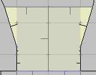
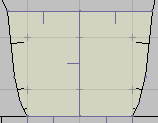
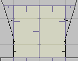

# ZDBSP

ZDBSP is a stand-alone version of ZDoom's internal node builder. Although it
has a several features built specifically with ZDoom in mind, ZDBSP is also
perfectly capable of building nodes for vanilla Doom engine games too.

It was written with two primary design goals in mind:

* It must be fast. The original node builder was just going to be used to fix
  map errors in ZDoom. After adding GL nodes support, ZDoomGL also started
  using it as a preprocessing step for any maps without existing GL nodes. In
  both cases, the node builder needed to be quick in order to minimize the time
  the user was forced to wait before playing a map.
* Polyobject bleeding must be minimized. The node builder was tested with the
  standard Hexen maps and several user maps, and it has been able to prevent
  bleeding on all properly-formed maps. Later versions of ZDoom make bleeding a
  non-issue by running an abbreviated form of the node builder at runtime as
  polyobjects move, but see the [polyobjects](#polyobjects) section below for
  historical guidance.

## License

This program is free software; you can redistribute it and/or modify it under
the terms of the [GNU General Public
License](http://www.gnu.org/licenses/gpl.html) as published by the Free
Software Foundation; either version 2 of the License, or (at your option) any
later version.

This program is distributed in the hope that it will be useful, but WITHOUT ANY
WARRANTY; without even the implied warranty of MERCHANTABILITY or FITNESS FOR A
PARTICULAR PURPOSE. See the GNU General Public License for more details.

You can also find a copy of the license as the file COPYING in the source
distribution.

## Usage

### From your editor

[Ultimate Doom Builder](https://ultimatedoombuilder.github.io/) comes with
configurations for ZDBSP if you just want to use it without thinking about it
much, but it also comes with several command-line options if you want to tinker
or batch process node building.

### Command line examples

* Build nodes for a map that will work with vanilla Doom or any source port:
  ```
  zdbsp --zero-reject --map=MAP01 MyWad.wad --output=MyWadWithNodes.wad 
  ```
* Build nodes for a map, but create an empty REJECT lump instead of one filled
  with zeroes to save space. This works for ZDoom and any source ports that
  understand that an empty REJECT is the same as a zero-filled one, but won't
  work with vanilla Doom:
  ```
  zdbsp --empty-reject --map=MAP01 MyWad.wad --output=MyWadWithNodes.wad
  ```
* Create a map with both regular and GL nodes:
  ```
  zdbsp --empty-reject --gl --map=MAP01 MyWad.wad --output=MyWadWithNodes.wad
  ```
* The output file can be the same as the input file to avoid creating a new
  file:
  ```
  zdbsp --map=MAP01 MyWad.wad --output=MyWad.wad
  ```
* Leave out the `--map` option, and ZDBSP will rebuild nodes for every map in a
  wad. Without a `reject` option, it also keeps the existing REJECT lump
  intact:
  ```
  zdbsp MyWad.wad --output=MyWad.wad
  ```
* Go all-in on ZDoom's space-saving node options:
  ```
  zdbp --empty-reject --empty-blockmap --compress MyWad.wad --output=MyZDoomWad.wad
  ```

### Command line options

ZDBSP supports several command line options to affect its behavior. If you
forget what they are, you can view a quick summary of them by running ZDBSP
without any options. Each one is also listed below in more detail than the
listing ZDBSP provides. Note that these options are case-sensitive, so `-r` is
not the same thing as `-R`. You can use either the long form of an option or
the short form depending on your preference.

#### Informational

* **--help**  
  Displays a summary of all ZDBSP's command line options, as if you had run
  ZDBSP without any options.
* **--version** or **-V**  
  Displays ZDBSP's version number.
* **--warn** or **-w**  
  Displays extra warning messages that ZDBSP might generate while building GL
  nodes. The nodes will still be usable if warnings occur, and warnings are not
  unlikely. If you have strange display problems with GL nodes, turning on the
  warning messages may help locate the problem.
* **--no-timing** or **-t**  
  If you don't care how long it takes to build nodes, use this option and ZDBSP
  won't tell you.

#### Output control

* **--map=_MAP_** or **-m*MAP***  
  When you use this option, ZDBSP builds nodes for only one map in a wad
  instead of rebuilding the nodes for every map contained in the wad. _MAP_
  should be the map's full name (e.g. MAP01 or E1M1)
* **--output=_FILE_** or **-o*FILE***  
  Normally, ZDBSP creates a new wad named tmp.wad. You can use this option to 
  make it write to a different file instead. In the case of WadAuthor, this is 
  used to make ZDBSP overwrite the original file with the new one, because
  that's what WadAuthor expects the node builder to do.
* **--comments** or **-c**  
  Write thing, linedef, sidedef, sector, and vertex indices as comments in
  UDMF maps.

#### Node control

* **--gl** or **-g**  
  This option causes ZDBSP to build two sets of nodes for a map: One set of
  regular nodes and one set of GL nodes. Because ZDBSP has to do twice the
  work, expect it to take about twice as long to finish.
* **--gl-matching** or **-G**  
  Like the previous option, this one also makes ZDBSP generate GL nodes.
  However, it will only build one set of nodes and then strip the extra GL
  information from them to create the normal nodes. Because of this, it's
  faster than the previous option when you want to create GL nodes, but the
  normal nodes may be less "efficient" because they were created from the GL
  nodes.
* **--gl-only** or **-x**  
  Only build GL nodes. If a map has regular nodes, they will be removed.
* **--gl-v5** or **-5**  
  Normally, [v5 GL](https://glbsp.sourceforge.net/specs.php#Versions) nodes are
  only written if the built nodes exceed the limits of v2 GL nodes. This option
  overrides that decision-making and always writes v5 GL nodes. v5 nodes offer
  no other benefits over v2 nodes than being able to work with larger maps, so
  you generally shouldn't need to use this option unless you have some specific
  reason for wanting v5 nodes.
* **--compress** or **-z**  
  Write nodes using ZDoom's compressed format. Compressed nodes take up less
  space than uncompressed nodes, they're the only way to save nodes with more
  than 65535 segs, and they also have higher vertex precision than normal
  nodes, reducing the possibility of slime trails. If GL nodes are built, they
  also use the compressed format. Compressed nodes have their own special
  format compared to regular Doom nodes. A specification is given
  [below](#compressed-node-formats).
* **--compress-normal** or **-Z**  
  This is exactly like the previous option, except it only applies to normal
  nodes. GL nodes are written in the standard glBSP format.
* **--extended** or **-X**  
  Creates extended nodes. This is exactly like `--compress`, except the
  resultant nodes aren't also processed through zlib. The underlying data
  format is the same between the two.
* **--no-nodes** or **-N**  
  This option causes ZDBSP to take the node information from the old wad file
  and write it to the new wad file. I can't think of any reason why you would
  want to do this, but it's provided as an option nonetheless.

#### Node tuning options

* **--partition=_NNN_** or **-p*NNN***  
  This option controls the maximum number of segs to consider for splitters at
  each node. The default is `64`. By increasing it, you might be able to
  generate "better" nodes, but you get diminishing returns the higher you make
  it. Higher values are also slower than lower ones.
* **--split-cost=_NNN_** or **-s*NNN***  
  This option adjusts how hard ZDBSP tries to avoid splitting segs. The default
  value is `8`. By increasing this, ZDBSP will try harder to avoid splitting
  segs. If you decrease it, ZDBSP will split segs more frequently. More splits
  mean the BSP tree will usually be more balanced, but it will also take up
  more room.
* **--diagonal-cost=_NNN_** or **-d*NNN***  
  This option controls how hard ZDBSP tries to avoid using diagonal splitters.
  The default value is `16`. A higher value means that diagonal splitters are
  more likely to be used. This can sometimes help to reduce the number of segs
  in a map. The reasons for preferring axis-aligned splitters are two-fold:
  1. Node bounding boxes fit best when splitters are axis-aligned.
  2. Normal nodes don't store any fractional information for the vertices that
     segs use, so slime trails may be more likely with diagonal splitters than
     with axis-aligned ones.

#### Reject control

* **--empty-reject** or **-r**  
  When this option is used, ZDBSP writes a zero-length `REJECT` to the wad. As
  of this writing, ZDoom is the only port that supports this. A zero-length
  `REJECT` is the same thing as a reject filled with zeros. Because ZDBSP
  doesn't generate a `REJECT` table, and the usefulness of having a `REJECT` is
  questionable on 21st century machines (except perhaps for very large maps),
  you should always use this option if you intend for the map to be played
  solely with ZDoom.
* **--zero-reject** or **-R**  
  This option is similar to the previous one, except ZDBSP writes out a
  full-sized `REJECT` lump filled with zeros. If you play with ZDoom, this is
  just wasted space, but other ports and Doom itself require a full-sized
  `REJECT` lump to work.
* **--no-reject** or **-E**  
  This option makes ZDBSP copy the `REJECT` lump from the old wad to the new
  wad unchanged. However, if it detects that the old `REJECT` is the wrong size
  for the number of sectors in the map, it will be removed as if you had used
  the `--empty-reject` option. This is the default option if you don't specify
  another reject mode.

#### Miscellaneous control

* **--empty-blockmap** or **-b**  
  This option writes a zero-length `BLOCKMAP` to the wad. As of this writing,
  ZDoom is the only port that will detect this and build the `BLOCKMAP` itself.
* **--no-sse**  
  Disables all SSE optimizations in the node builder, which can be useful if you
  just want to measure the kind of speed up SSE or SSE2 provides.
* **--no-sse2**  
  Disables all SSE2 optimizations in the node builder. SSE1 will still be used
  if your processor supports it. Unless you want to compare the speed
  difference between SSE and SSE2, there is again little reason to use this
  option.
* **--no-polyobjs** or **-P**  
  This option disables ZDBSP's polyobject detection code. If you're building
  nodes for a map without polyobjects, you might be able to save a fraction of
  a second from the build time by using this option, but there's generally no
  reason to use it.
* **--view** or **-v**  
  Under Windows, this displays a viewer that will let you inspect a map's 
  subsectors, nodes, and `REJECT`. To scroll the map around, drag it with your 
  right mouse button. The viewer was created to assist with debugging with the
  GL nodes. It's not very user-friendly nor is it bug-free. In fact, if you try
  to build nodes for more than one map with this option, there's a good chance
  ZDBSP will crash.

## Compressed Node Formats

The following information describes the format used to store ZDoom's compressed
nodes. If you're just a regular user, you can skip this section.

### Datastream layout

Compressed nodes contain all the same information as regular nodes but are 
stored in a single lump and compressed as a zlib data stream. They also support 
more than 65535 segs and vertices by storing references to them using four
bytes instead of two.

The first four bytes of the compressed nodes are a four-character
(uncompressed) signature. This can be either `ZNOD` for regular nodes or `ZGLN`
for GL nodes. When there are more than 65534 lines in the map, the signature
`ZGL2` is used for GL nodes instead. (Note that this only happens with UDMF
maps, because the binary map format doesn't allow more lines than that.)
There's also a third variant of `ZGLN`: `ZGL3` is identical to `ZGL2` but
expands the node's splitter field to fixed point coordinates.

Following the signature is the zlib data stream. Its definition is outside
the scope of this documentation. Refer to
[RFC 1950](https://datatracker.ietf.org/doc/html/rfc1950) and
[RFC 1951](https://datatracker.ietf.org/doc/html/rfc1951) for more details.
Or just use [zlib](https://zlib.net/) to read it and don't worry about the
format.

When decompressed, the following information is obtained in this order:

1. [Vertex data](#vertex-data)
2. [Subsector data](#subsector-data)
3. [Seg data](#seg-data)
4. [Node data](#node-data)

Each section starts with a count of items for that section, followed by the
item data. To read a later section, you must first read all data from the
prior sections. Seeking isn't possible, but the sections are ordered such that
each one builds on top of what came before it, so there's also not much reason
to skip around.

#### Extended nodes

For the benefit of ports not wishing to support zlib decompression of nodes,
there are variants of the compressed node formats without compression. These
are called extended nodes, and differ only from their compressed counterparts
in that their contents aren't stored in a zlib datastream. They use a different
signature to distinguish them from compressed nodes, replacing the `Z` with an
`X`:

* `ZNOD` → `XNOD`
* `ZGLN` → `XGLN`
* `ZGL2` → `XGL2`
* `ZGL3` → `XGL3`

Other than those differences, they're exactly the same, and everything that
follows for compressed nodes applies equally to extended nodes.

### Datastream storage

While regular nodes are split across three separate lumps, compressed nodes
repurpose these lumps to allow for storing normal and GL nodes together with
their maps in the same place where existing tools expect to find nodes, unlike
glBSP, which stores its data in lumps separate from the maps.

1. Normal nodes (signature `ZNOD`) are stored in a map's `NODES` lump. Bear in
   mind that compressed nodes are contained entirely within this one lump.

2. GL nodes (signature `ZGLN`) are stored in a map's `SSECTORS` lump. Unlike
   regular GL nodes, no new lumps are created for compressed GL nodes.

3. The `SEGS` lump is left unused and should be written with a length of 0. I
   may find some way to "hijack" this lump in the future, so programs that read
   compressed nodes must not assume that if the `SEGS` lump is non-empty, then
   compressed nodes are not used.

For UDMF maps, nodes are stored in the map's `ZNODES` lump. These will only be
`ZGLN`, `ZGL2`, or `ZGL3` format nodes. Non-GL nodes are not supported for
UDMF.

### Types

The following sections use these types:

* **UINT8**: A single unsigned byte. The number can be in the range [0, 255].
* **UINT16**: An unsigned integer stored in two bytes. The number can be in the
  range [0, 65535].
* **INT16**: A signed integer stored in two bytes. The number can be in the
  range [-32768, 32767].
* **UINT32**: An unsigned integer stored in four bytes. The number can be in
  the range [0, 4294967295].
* **FIXED**: A signed 16.16 fixed-point number stored in four bytes. The
  most-significant two bytes store the integer part of the number, and the
  least-significant two bytes store the fractional part of the number. The
  number can be in the approximate range [-32768.99998, 32767.99998].

All multi-byte numbers are stored with their least significant byte first (i.e.
little-endian).

### Vertex data

Vertex data starts with two counts followed by a series of 8-byte (X, Y)
coordinate pairs repeated _NewVerts_ times: 

| Type   | Label         | Description
|--------|---------------|--------------
| UINT32 | OrgVerts      | Number of vertices used from the `VERTEXES` lump for binary maps, or from the map data for UDMF maps
| UINT32 | NewVerts      | Number of additional vertices that follow
|        |               |
| FIXED  | X             | X-Coordinate for first additional vertex
| FIXED  | Y             | Y-Coordinate for first additional vertex
| . . .  | . . .         | . . . Repeat until _NewVerts_ vertices are defined . . .

These are all the _additional_ vertices that the segs use. Unlike normal nodes,
extra vertices aren't added to the `VERTEXES` lump. They're stored here
instead. When determining which vertex `v` a seg uses, if `v` < `OrgVerts`,
then `v` is a vertex in the `VERTEXES` lump. Otherwise, when `v` >= `OrgVerts`,
`v - OrgVerts` is the index of a vertex stored here.

Like version 2 GL nodes, the vertices stored here are represented as 16.16
fixed point numbers in order to maintain the full precision of the Doom engine.

### Subsector data

Subsector data starts with a count of the subsectors followed by a count of the
segs in each subsector. Each subsector is 4 bytes long:

| Type   | Label         | Description
|--------|---------------|--------------
| UINT32 | NumSubsectors | Number of subsectors that follow
|        |               |
| UINT32 | NumSegs       | Number of segs for the first subsector
| . . .  | . . .         | . . . Repeat until _NumSubsectors_ subsectors are defined . . .

Unlike normal nodes, the first seg in each subsector isn't stored. This can be 
inferred by the ordering of the subsectors. The first subsector always starts 
at seg 0, and each following subsector begins with the seg immediately after 
the previous subsector's last seg.

### Seg data

Seg data starts with a total count of the number of segs, followed by data for
each seg. The specific layout for the seg data depends on if the data stream
represents normal nodes or GL nodes. In either case, the segs are stored in an
11 byte structure, but their contents differ slightly; GL nodes store a partner
seg instead of a second vertex. _There is no padding to make these align to a
4-byte boundary._

#### Normal segs (`ZNOD` signature)

| Type   | Label         | Description
|--------|---------------|--------------
| UINT32 | NumSegs       | Number of segs
|        |               |
| UINT32 | v1            | Seg's first vertex
| UINT32 | v2            | Seg's second vertex
| UINT16 | Line          | The linedef this seg came from
| UINT8  | Side          | Which side of the linedef this seg came from (0=front, 1=back)
| . . .  | . . .         | . . . Repeated until _NumSegs_ segs are defined . . .

Note that unlike standard nodes, the seg's angle and offset aren't
included. ZDoom doesn't need this information, and other ports that do can
recompute them trivially.

#### GL segs (`ZGLN` signature)

| Type   | Label         | Description
|--------|---------------|--------------
| UINT32 | NumSegs       | Number of segs
|        |               |
| UINT32 | v1            | Seg's first vertex
| UINT32 | **Partner**   | Seg's partner seg (0xFFFFFFFF if none)
| UINT16 | Line          | The linedef this seg came from (0xFFFF if none)
| UINT8  | Side          | Which side of the linedef this seg came from (0=front, 1=back, ignored if no line)
| . . .  | . . .         | . . . Repeat until _NumSegs_ segs are defined . . .

The partner seg is the seg on the other side of this one. If this seg didn't
come from a line, this is a miniseg that was inserted in order to make the
subsector form a complete polygon.

#### Extended GL segs (`ZGL2` and `ZGL3` signature)

These versions expand the line field to 4-bytes to allow for more than
65535 lines in a map, bringing the size of each seg to 13 bytes:

| Type       | Label         | Description
|------------|---------------|--------------
| UINT32     | NumSegs       | Number of segs
|            |               |
| UINT32     | v1            | Seg's first vertex
| UINT32     | Partner       | Seg's partner seg (0xFFFFFFFF if none)
| **UINT32** | Line          | The linedef this seg came from (0xFFFFFFFF if none)
| UINT8      | Side          | Which side of the linedef this seg came from (0=front, 1=back, ignored if no line)
| . . .      | . . .         | . . . Repeat until _NumSegs_ segs are defined . . . 

#### Finding the second vertex for GL segs

Unlike glBSP nodes, compressed GL nodes don't store each seg's second
vertex. This is because GL subsectors must form a closed area. In other words,
one seg's second vertex is the same as the next seg's first vertex. The
subsector information contains everything you need to know to close each area
and start a new one.

Example: Suppose you haven't read any segs yet, and the first subsector has 
four segs. Therefore, the second vertex for the first four segs can be 
determined to be:

So for each subsector, all but the last seg's second vertex will be the same as
the next seg's first vertex, and the last seg's second vertex will be the same
as the first seg's first vertex.

|       |                                       |
|-------|---------------------------------------|
| Seg 0 | Second vertex is Seg 1's first vertex |
| Seg 1 | Second vertex is Seg 2's first vertex |
| Seg 2 | Second vertex is Seg 3's first vertex |
| Seg 3 | Second vertex is Seg 0's first vertex (because this is the last seg in the subsector) |

### Node data

Node data starts with a count of the number of nodes, followed by the node
data. These are essentially the same as standard nodes, except that child
references are stored using four bytes instead of two. If a child's high bit is
set, then it's a subsector. If it's clear, then it's another node.

#### All nodes formats except 'ZGL3'

Each node is 32 bytes long.

| Type      | Labels                       | Description
|-----------|------------------------------|--------------
| UINT32    | NumNodes                     | Number of nodes
|           |                              |
| 4 INT16s  | X, Y, dX, dY                 | Position and direction of this node's splitter
| 4 INT16s  | Top0, Bottom0, Left0, Right0 | Bounding box for `Child0`
| 4 INT16s  | Top1, Bottom1, Left1, Right1 | Bounding box for `Child1`
| UINT32    | Child0                       | Reference to child in front of the splitter
| UINT32    | Child1                       | Reference to child behind the splitter
| . . .     | . . .                        | . . . Repeat until _NumNodes_ nodes are defined . . . 

#### Nodes with 'ZGL3' signature

`ZGL3` nodes store splitters with more precision than other formats and was
created for use with UDMF, which allows for fractional map coordinates on
lines.

Each node is 40 bytes long.

| Type         | Labels                       | Description
|--------------|------------------------------|--------------
| UINT32       | NumNodes                     | Number of nodes
|              |                              |
| 4 **FIXED**s | X, Y, dX, dY                 | Position and direction of this node's splitter
| 4 INT16s     | Top0, Bottom0, Left0, Right0 | Bounding box for `Child0`
| 4 INT16s     | Top1, Bottom1, Left1, Right1 | Bounding box for `Child1`
| UINT32       | Child0                       | Reference to child in front of the splitter
| UINT32       | Child1                       | Reference to child behind the splitter
| . . .        | . . .                        | . . . Repeat until _NumNodes_ nodes are defined . . . 

## Historical interest

### Polyobjects

One of ZDBSP's most important features was (and is, for vanilla Hexen) that it
tries very hard to avoid polyobject bleeding. To make this feature work,
however, you must design your maps properly. You do this be ensuring that your
polyobjects are always shown inside a
[convex](https://en.wikipedia.org/wiki/Convex_polygon) sector. This is
referring to the area where the polyobjects appear in the game, not where they
appear in an editor.

Ironically, an example of what _not_ to do is in Hexen's MAP01. The 
polyobject doors at the very start of that map don't appear in a convex area. 
ZDBSP is tuned so that they display properly with the default options, but you
shouldn't count on this for your own maps.

If ZDBSP has to split a linedef around a polyobject's display area, it prints a
message indicating where this happened so that you can inspect the area and fix
it. For example, when you use ZDBSP on hexen.wad, it outputs these warnings for
MAP01:
```
Split seg 929 (-1176,1312)-(-1088,1312) of sector 265 on line 572
Split seg 931 (-1088,1312)-(-1000,1312) of sector 265 on line 573
```
The important pieces of information here are the coordinates of the segs that 
were split and the lines those segs were made from. In this case, both lines 
572 and 573 were split. Because they surround a polyobject's display area, 
ideally they shouldn't split, so you need to look at the map in an editor 
to determine what made them split. This happens because the area isn't convex, 
so you need to look for a line in the same "loop" that, if you made it longer, 
could cross the line that was split. In this example, lines 575 and 579 are 
responsible for splitting line 572, and lines 576 and 578 are responsible for 
splitting line 573. You can fix the error by reworking the area so that it's 
convex, either by moving lines 575, 579, 576, and 578, or by adding additional 
lines to separate each half into four convex pieces.

Below are some illustrations. The areas where the two polyobjects appear have 
been highlighted.

This first image shows the area as it appears in hexen.wad, unmodified. Note
that neither side is convex, so ZDBSP needs to split each side into two
subsectors. The extra subsectors are highlighted below in a brighter color to
illustrate how ZDBSP splits them.

> 

In the next image, the lines have been moved to make each side convex:

> 

In the final image, new two-sided lines have been added to make 
each polyobject's display area rectangular. Unlike the line-moving method 
above, this does not alter the area's appearance. Notice that this looks a lot 
like the way ZDBSP split them in the first image. The difference is that by 
adding the extra lines yourself, you have control over how the split is done 
and ZDBSP doesn't need to guess about the best way to make the area convex.

> 

Unfortunately, if you use WadAuthor, ZDBSP's output window won't normally 
appear long enough for you to actually read it. You can get around this by 
adding the -v option to the ZDBSP command line that WadAuthor uses (see the 
Using ZDBSP with WadAuthor section). Then its output will stay around until you 
close the ZDBSP viewer.

### Using ZDBSP with WadAuthor

First, copy zdbsp.exe to your [WadAuthor](https://doomwiki.org/wiki/WadAuthor)
directory. Then start WadAuthor and choose "Options..." from its Tools menu.
Select the "Files" tab and choose "External" for Node Building. This activates
the Command text box so that you can type text into it. Copy and paste any of
the following into it based on what you want to do.

Create a map that can be played with Doom or any source port:

```
zdbsp -R -m$_Mapname $_Wadfile -o$_Wadfile
```

Create a map that will only be played with ZDoom. This will be 
ZDoom-only because it creates a zero-length REJECT lump. ZDoom is smart enough 
to know that a zero-length REJECT lump is the same thing as a REJECT lump 
filled with zeros, so you can save space:

```
zdbsp -r -m$_Mapname $_Wadfile -o$_Wadfile
```

Create a map with both regular and GL nodes so that ZDoomGL doesn't 
need to build GL nodes:
```
zdbsp -rg -m$_Mapname $_Wadfile -o$_Wadfile
```
